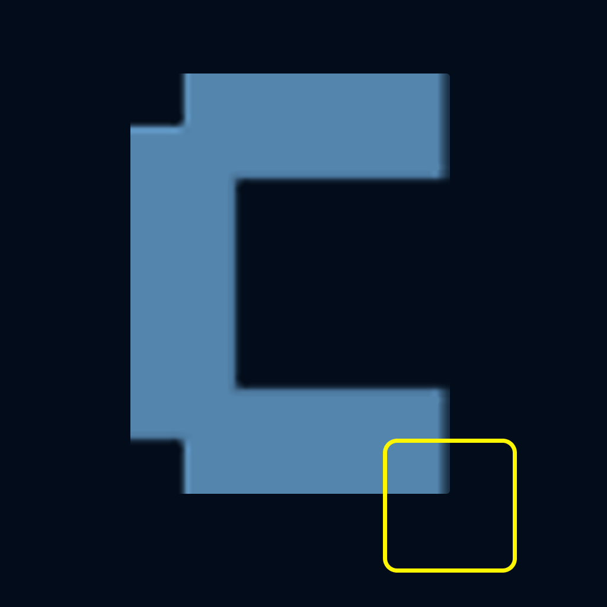
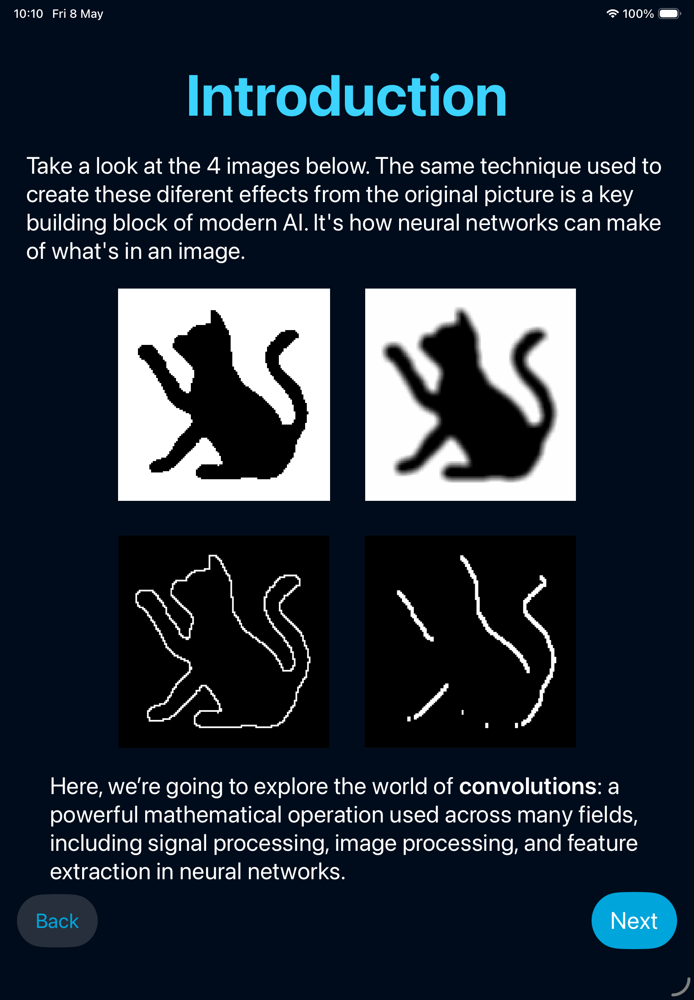
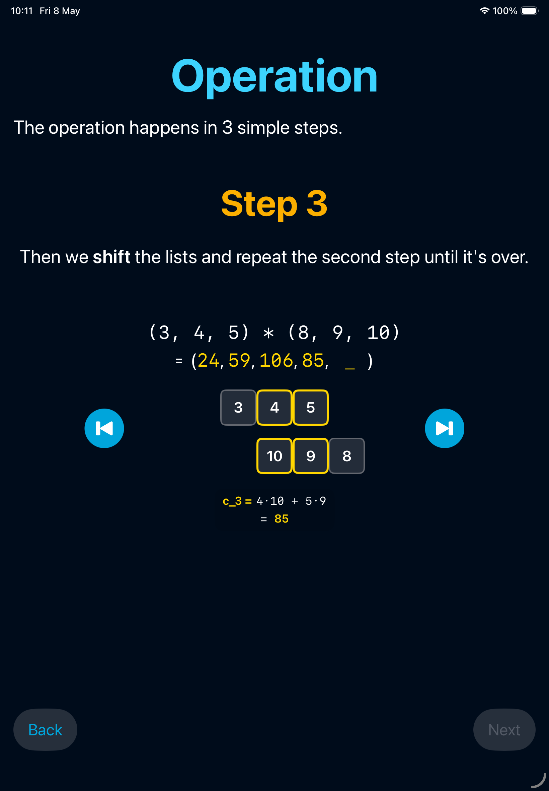
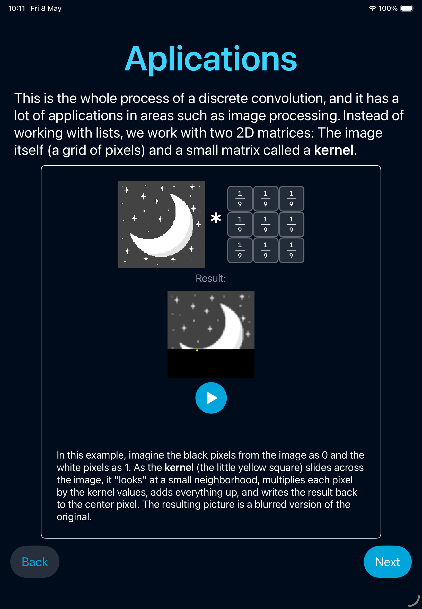
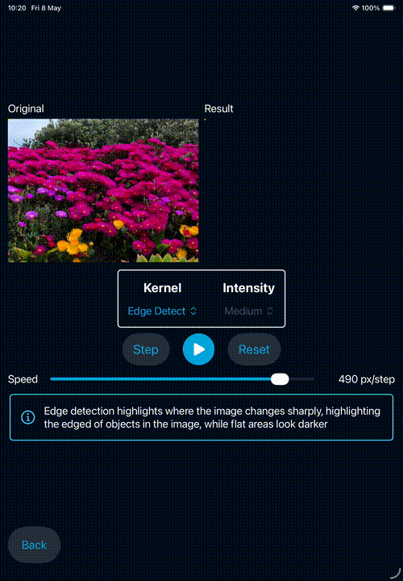

# Convolve: Convolution 101

     

Convolve is my submission for the 2026 WWDC's Swift Student Challenge. It's an interactive experience to teach the concept of convolution from calculus. It teaches the basics of the operation, how to calculate it and its usage in different areas like statistics and artificial intelligence. It also lets you apply the operation in different images, changing the kernel and watching it happen in real time over the pixels.

## Interactive teaching

    
    
    

Throughout the first part of the app, you learn the basics of convolutions, experimenting with the concepts as you learn them. The app includes animations that can be controlled at will, so that you can learn at your own pace. The teaching introduces you to the operation with the mathematical definition, lets you make the operation by yourself and implements all that you learned in pixel art so you can better understand its applications. 

## Playground

    

The app's main feature is its playground. Here you can experiment convolutions by applying it to different images, including images from the user's photo gallery. 

You can choose between different kernels and intensities, and watch the operation in real time over the pictures and observe how it interacts with the shapes and colors. The playground also includes explanations of what each kernel is doing.
